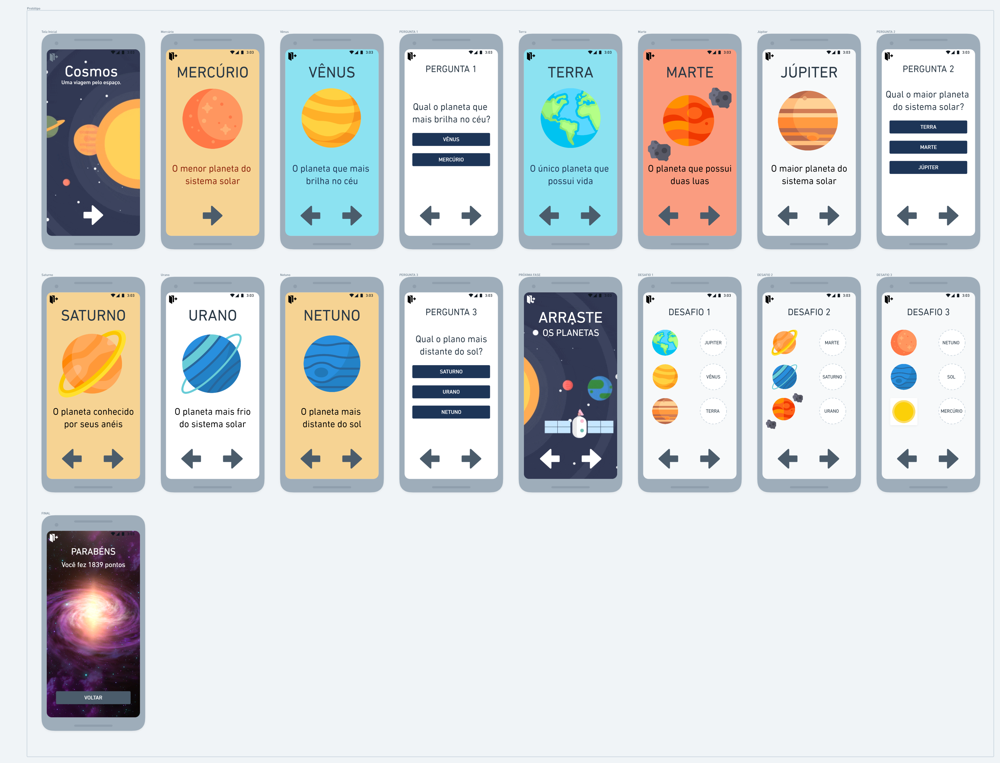
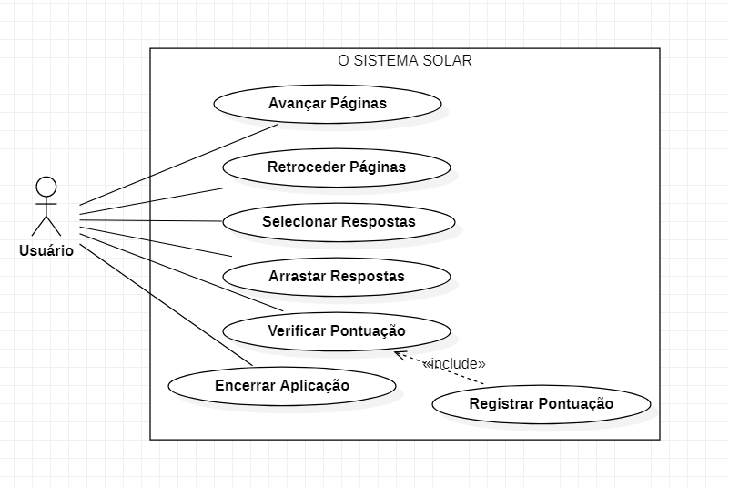

### O Sistema Solar

#### Integrantes
- Cesar Mauricio Chauchuty
- Erickson Tulio
- Matheus Schmidt
- Pablo Santos

#### Proposta
A composição do sistema solar.

#### Objetivo
Compreender os planetas que compõem nosso sistema solar, assim como suas curiosidades e características.

#### Fases
A primeira parte da proposta será uma sequência de "slides" explicativos sobre todos os planetas que compõem o sistema solar. Assim sendo, haverá perguntas as quais o usuário deverá responder.
A segunda parte solicitará ao usuário que arraste os planetas - suas imagens - para a posição corresponde que o exercício solicita.

#### Protótipo

#  
#  
#  
#### Use Case

#### Cronograma

| DATA       |             Descrição            |
|------------|----------------------------------|
| 05/04/2022 | Início do projeto                |
| 05/04/2022 | Escolha da proposta              |
| 05/04/2022 | Pesquisa da temática             |
| 05/04/2022 | Definição das etapas do projeto  |
| 05/04/2022 | Início do protótipo              |
| 11/04/2022 | Desenvolvimento do protótipo     |
| 11/04/2022 | Desenvolvimento do 'uso de caso' |
| 19/04/2022 | Conclusão do protótipo           |
| 19/04/2022 | Conclusão do 'use case'          |
